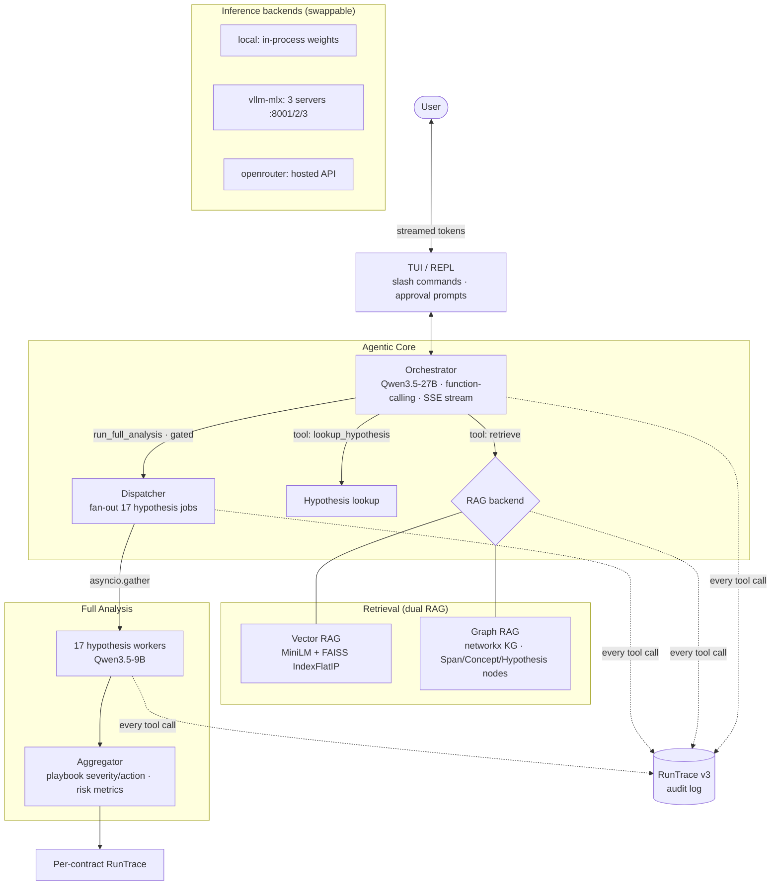

# ContractLens

An **agentic NDA-review system** built on [ContractNLI](https://stanfordnlp.github.io/contract-nli/). Given a non-disclosure agreement, ContractLens evaluates all **17 ContractNLI hypotheses** (H01–H17 — "Can confidential information be shared with employees?", "Is reverse-engineering prohibited?", …), classifies each as *Entailed / Contradicted / Not-Mentioned* with **grounded evidence spans**, applies a deterministic risk **playbook**, and exposes a **conversational agent** for free-form Q&A over the contract — with **every tool call audit-logged** into a schema-valid RunTrace.

It pairs a **QLoRA fine-tuned Qwen3-1.7B** NLI core with an **agentic orchestrator** (function-calling, streaming) and a **dual RAG** retrieval layer (vector **and** graph), and it runs against three interchangeable inference backends: **in-process weights, local vLLM-MLX servers, or hosted OpenRouter**.

> **Authorship.** A 5-person university project (ContractNLI, GUC). I built the **orchestrator** (OpenRouter function-calling + SSE streaming), the **function-calling tools layer**, the **approval gate**, and the **RunTrace v3 audit infrastructure** — plus, in the earlier phase, the data-preprocessing, SFT dataset construction, fine-tuning, and evaluation pipeline. Full per-member credits in [`docs/CONTRIBUTIONS.md`](docs/CONTRIBUTIONS.md). (Teammates' student IDs removed for privacy.)

---

## Results

Fine-tuned NLI core (Qwen3-1.7B + QLoRA, rank 4) on the full ContractNLI test split — **123 contracts, 2,091 hypothesis instances**:

| Metric | Value |
|---|---|
| **Label accuracy** | **0.8513** |
| **Groundedness** (cited spans always in-range for Entailed/Contradicted) | **1.0000** |

Strong for a 1.7B model; the adapter is on the Hugging Face Hub: [`Youssef-Malek/contractnli-vast-ai-qwen3-1.7b`](https://huggingface.co/Youssef-Malek/contractnli-vast-ai-qwen3-1.7b).

---

## Architecture



### Highlights / intricacies

- **Swappable inference backend via a loader factory.** `get_loader(mode)` returns one of three loaders behind a single `ModelHandle` interface:
  - `local` — weights loaded into process memory (transformers).
  - `vllm` — three independent **vLLM-MLX** servers (`:8001` Orchestrator `Qwen3-4B-4bit`, `:8002` the merged + MLX-converted fine-tuned NLI 1.7B, `:8003` base `Qwen3-1.7B-4bit`); only tokenizers (~10 MB) are local, and each load **health-checks** that the server is reachable *and* serving the expected model ID.
  - `openrouter` — hosted inference (Qwen 3.5-27B orchestrator, 9B workers).
- **Streaming function-calling orchestrator.** The orchestrator streams Server-Sent Events surfaced as an `AsyncIterator` the TUI renders token-by-token — distinct event kinds for `think` (reasoning), `content`, `tool_call`, `tool_result`, and `turn_complete`. Tool outputs are reinjected as `role=tool` messages and the model re-streams until it returns content-only, capped by `MAX_TOOL_ITERS` to prevent runaway loops.
- **Approval-gated heavy tool.** `run_full_analysis` is expensive, so the orchestrator must pass through a human **approval gate** before it fires.
- **Fan-out analysis with leakage control.** The dispatcher fans out **17 hypothesis jobs** (`asyncio.gather`), each sending the contract + one hypothesis + RAG background examples to a Qwen3.5-9B worker. Crucially, workers are **never told a RAG system exists** — retrieved spans are framed only as optional "background examples," and final evidence is **forced to come solely from the analyzed contract** (no train-corpus leakage into citations).
- **Dual RAG.** A FAISS vector index (MiniLM `all-MiniLM-L6-v2`, `IndexFlatIP`) over training spans, *and* a hand-built networkx **knowledge graph** (`SpanNode`/`ConceptNode`/`HypothesisNode` with `CONTAINS`/`CITED_FOR`/`INVOLVES` edges and ~19 legal concepts + synonym lists) supporting hypothesis-targeted or free-text retrieval.
- **Cross-cutting audit (`RunTrace`).** A `runtrace_recorder` exposes both a context-manager and a decorator so **every tool call by every agent** is logged automatically into a v3 RunTrace — the system produces a complete, schema-valid audit chain per contract.
- **Deterministic playbook.** The aggregator maps each hypothesis result to severity / action / rationale via `playbook.yaml`, adds evidence-required validation failures the worker missed, and computes risk metrics across all 17 — keeping LLM judgment and deterministic policy cleanly separated.

---

## Repository layout

| Path | What's there |
|---|---|
| `src/orchestrator.py` | Streaming function-calling orchestrator (OpenRouter) |
| `src/tools.py` | The 3 tools + `ToolContext` DI (ContextVar-bound) |
| `src/dispatcher.py` · `src/aggregator.py` | 17-way fan-out analysis + playbook enrichment |
| `src/rag_vector.py` · `src/rag_graph.py` | Vector (FAISS) and Graph (networkx) RAG |
| `src/runtrace_recorder.py` · `src/runtrace.py` | Cross-cutting audit logging + v3 schema |
| `src/conversation_agent.py` · `src/tui.py` · `src/session.py` | Conversational agent, REPL, session state |
| `src/loaders/` | `local`, `vllm`, `openrouter` loaders behind one interface |
| `pipeline/` | Preprocess → fine-tune → build indexes → evaluate |
| `architecture/` | Architecture spec (`architecture.yaml`) + report |
| `playbook.yaml` · `schemas/` | Deterministic risk playbook + JSON schemas |

---

## Quick start

```bash
cp .env.example .env        # set OPENROUTER_API_KEY=sk-or-v1-...
pip install -r requirements.txt

# Interactive agentic REPL over a sample NDA (real RAG + orchestrator)
python scripts/demo_m1.py --idx 0
python scripts/demo_m1.py --idx 0 --dev          # stream the orchestrator's <think>
python scripts/demo_m1.py --prompt "what does this NDA say about consultants?"
```

Backends are selected at load time — default `openrouter` (hosted), or run fully locally with the vLLM-MLX servers (see [`ServeLM`](https://github.com/Youssef-Malek2004/ServeLM) and the loader docstrings).

---

## Tech Stack

**Models:** Qwen3 (1.7B fine-tuned NLI core, 4B orchestrator local / 27B + 9B hosted) ·
**Fine-tuning:** QLoRA (Unsloth), MLX conversion ·
**Serving:** vLLM-MLX, OpenRouter, Hugging Face Transformers ·
**RAG:** FAISS, SentenceTransformers (MiniLM), NetworkX ·
**Runtime:** Python `asyncio`, SSE streaming, ContextVar DI

## License

University coursework — shared for portfolio/reference. See [`docs/CONTRIBUTIONS.md`](docs/CONTRIBUTIONS.md) for per-member credits.
